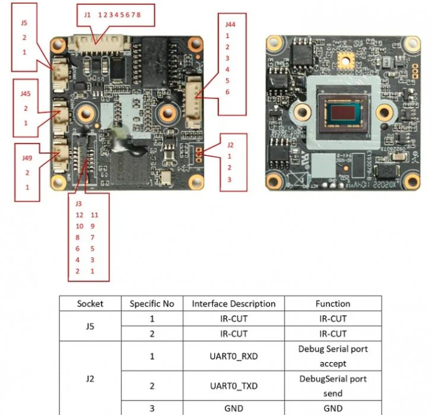
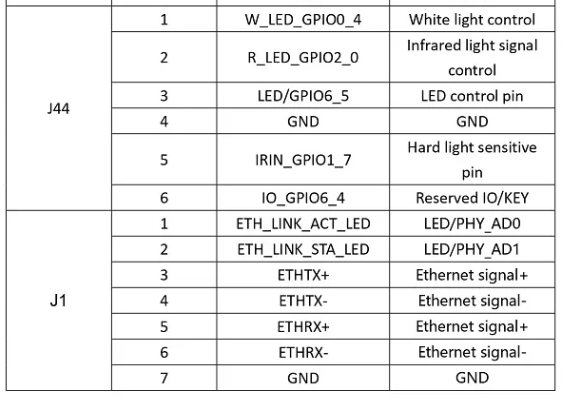
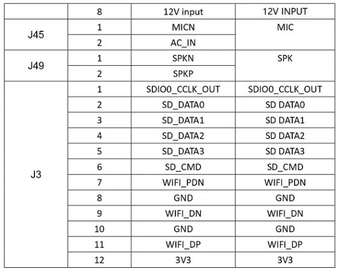

# XM IP Camera Module IVG-G3S

- [Devices](devices.md)

---

- [Xmeye 1080P Ip Camera Module Sony Imx307Lqr Goke Gk7205V210 3Mp Camera](https://aliexpress.ru/item/1005005876195954.html?spm=a2g2w.orderdetail.0.0.3d854aa6jkt6Rs&sku_id=12000034666744113)
    - Brand Name: XM
    - Model Number: IVG-G3S
    - CPU: GK7205V210
    - Sensor: Sony IMX307
    - Flash: 16MB NOR
    - U-Boot password 👿
    - Seller: [Okaidi Security Store](https://aliexpress.ru/store/911705087?g=y&page=1&searchInfo=search&spm=a2g2w.detail.0.0.7b5c1ca63r3Kuu) 
    - Price: 2145 ₽ (25.04.2024)
- [Storage And Wifi Multi-Function Expansion Board For Xm Network Module Camera](https://aliexpress.ru/item/1005005976463887.html?spm=a2g2w.orderdetail.0.0.69c24aa60ElT8R&sku_id=12000035136141238)
    - Seller: Okaidi Security Store
    - Price: 645 ₽ (25.04.2024)







## Majestic settings
### Night Mode

```
.nightMode.colorToGray: true
.nightMode.irCutPin1: 9
.nightMode.irCutSingleInvert: false
.nightMode.irCutPin2: 8
.nightMode.backlightPin:
.nightMode.overrideDrc:
.nightMode.lightMonitor: true
.nightMode.lightSensorPin:
.nightMode.lightSensorInvert: false
.nightMode.monitorDelay: 20
.nightMode.minThreshold: 2000
.nightMode.maxThreshold: 20000
```